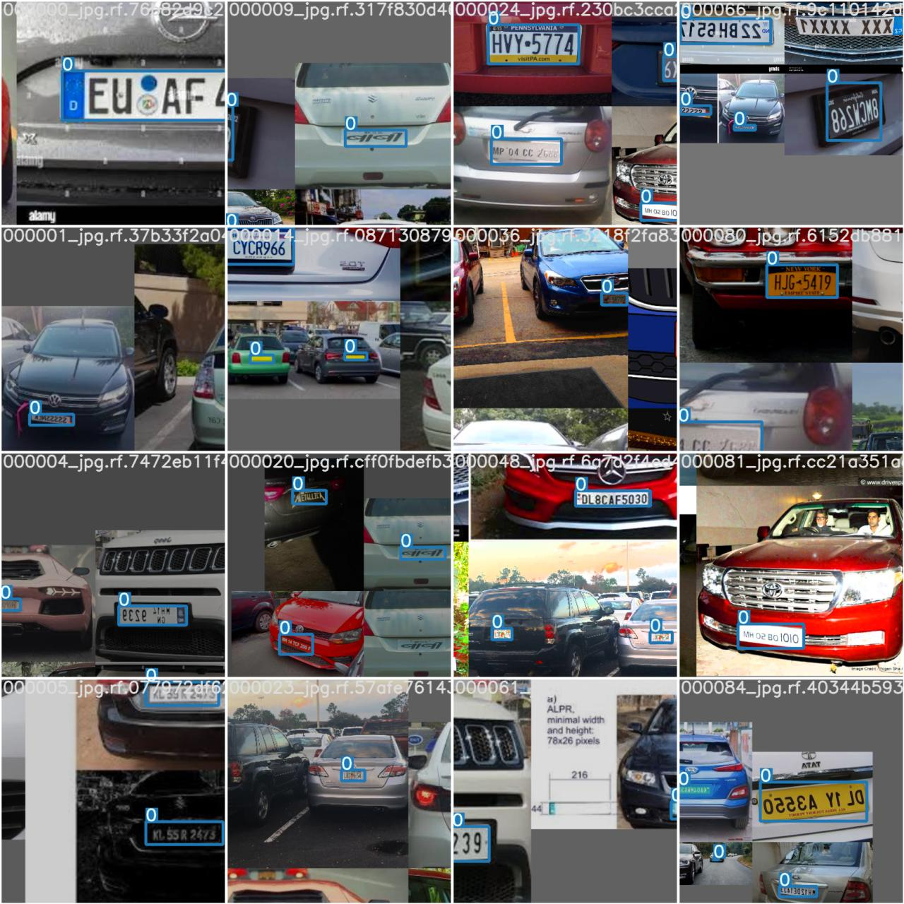
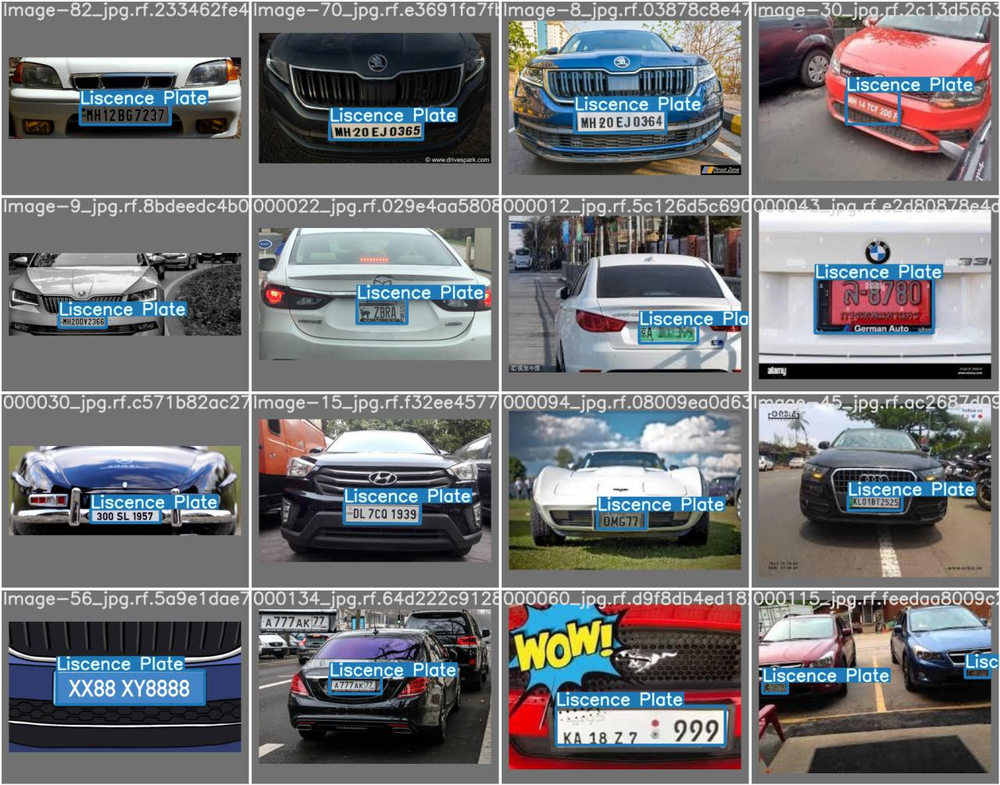

# YoloV5 License Plate Detector

This project uses Yolov5 Object Detection to identify license plates in the given images.
This also includes a selenium-based web scapper to create dataset of car images with license plates.

## Evaluation Matrices

F1 Score:

<image src="./Graphs/F1_curve.png" width=400/>

Precision:

<image src="./Graphs/P_curve.png" width=400/>

Recall:

<image src="./Graphs/R_curve.png" width=400/>

Results:

<image src="./Graphs/results.png" width=600/>

## Inferences

Train Batch Sample:

Test Batch sample:

